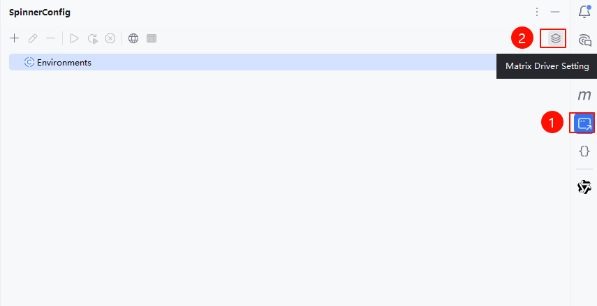
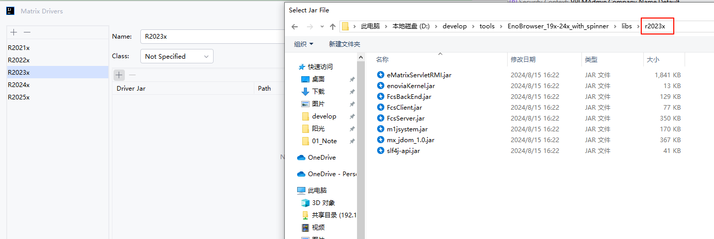
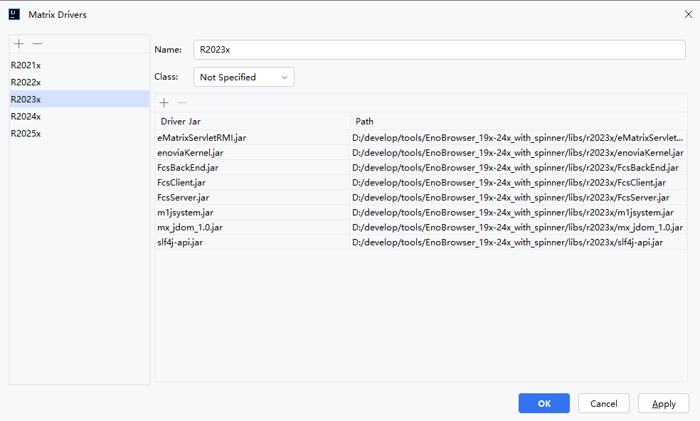
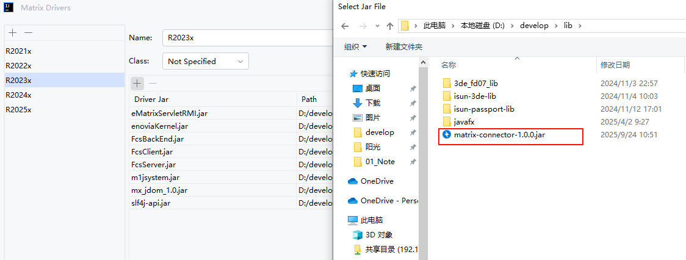
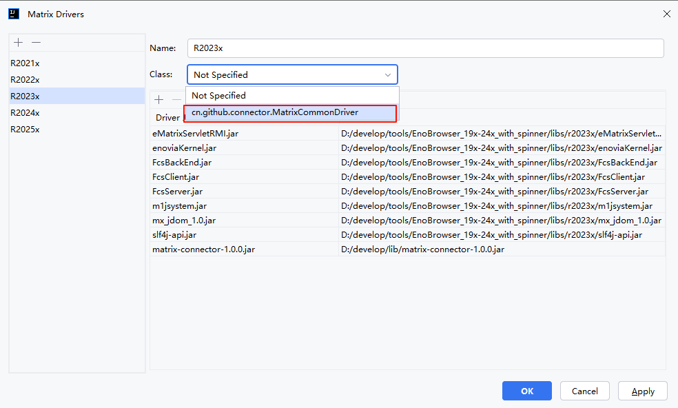
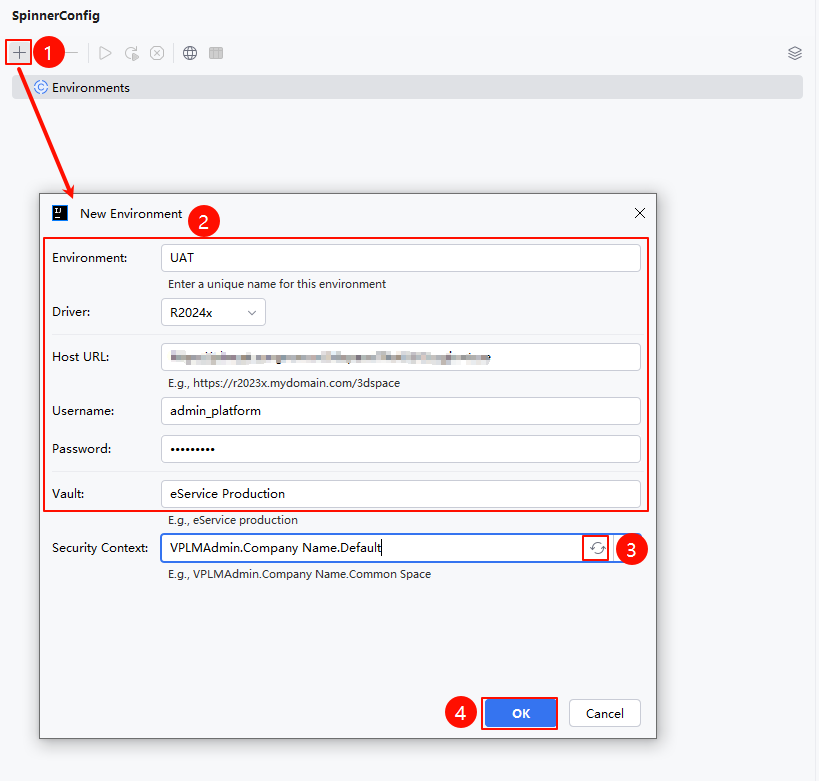
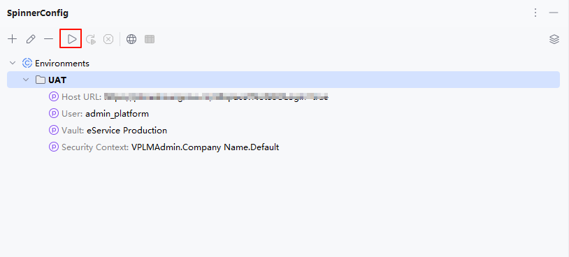
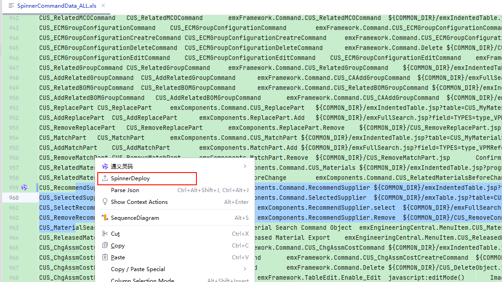
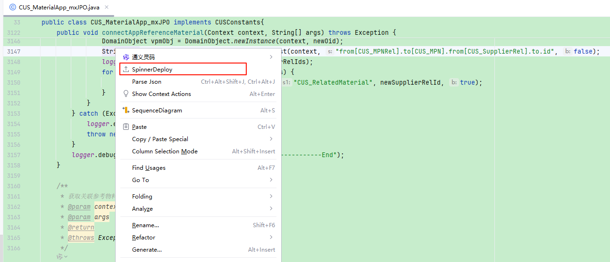
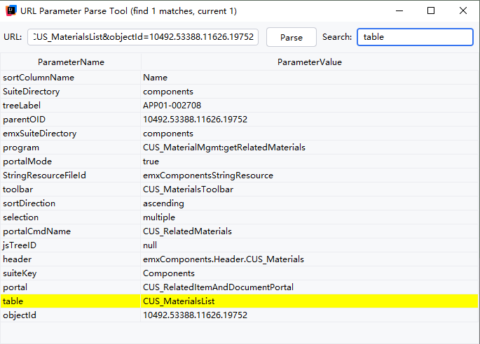

# SpinnerHelper

## 一、简介

> SpinnerHelper 是一款专为 IDEA 开发的插件，主要用于辅助 3DE的开发工作。
> 
> 通过简化部署流程和提供实用的辅助工具，提高 3DE 开发的效率和便捷性。
> 
> **核心功能**
> 1. **多版本多环境支持**：
>    - 通过配置，可以实现不同3DE版本环境的配置
>    - 通过配置，可以实现不同环境之间的切换
> 2. **Spinner 文件部署**：
>    - 通过右键菜单快速执行Spinner配置文件的增量或全量部署
> 3. **JPO 文件部署**：
>    - 提供对 JPO 文件的部署支持
> 4. **辅助工具**：
>    - **MQL Console**：
>      - 可直接执行 MQL 命令
>    - **URL Parameter Parse**：
>      - 提供 URL 参数解析功能
> 
> **配置要求**
> - 仅支持IDEA 2024.2 及以上版本
> - 需要自行准备对应3DE版本的依赖包

## 二、配置说明

### 1. 依赖及驱动配置
> 插件安装成功后，点击右侧SpinnerConfig按钮，打开配置页面，点击右上角配置按钮，进入配置页面

#### 1.1 依赖配置
> 选择与环境对应的依赖包，添加到依赖中 

#### 1.2 驱动配置
> 添加驱动并选择驱动

### 2. 环境配置
#### 2.1 添加环境
> 1. 点击添加按钮，弹出环境配置页面
> 2. 填写环境信息后，加载Security Context，选择对应的上下文
> 3. 点击确定保存

#### 2.2 连接环境
> 点击连接按钮，登录到环境

## 三、使用说明
### 1. Spinner文件部署
> 选择需要部署的Spinner配置，右键点击SpinnerDeploy
> 
> 说明：选择几行，则部署几行；若全选，则部署所有

### 2. JPO文件部署
> 选择需要部署的JPO文件，右键点击SpinnerDeploy

## 四、其他工具
### 1. MQL Console
> 执行MQL命令

### 2. URL Parameter Parse
> URL参数解析

