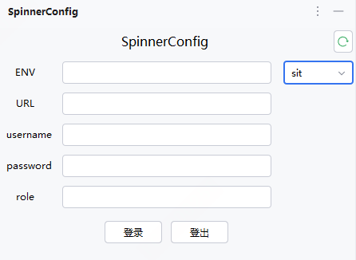
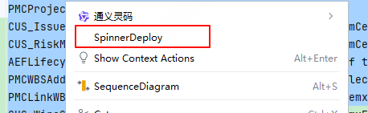

# SpinnerHelper

## Introduce

> 3DE开发辅助工具-Spinner文件快速部署

## 使用方式
1. 下载发布版插件，在IDEA中添加该插件
2. 安装好插件后，右侧会有如下按钮，点击按钮在页面中填写相应信息，登录

3. 选择对应的spinner配置文件，右键点击SpinnerDeploy

> 操作逻辑：
> 
>.xls文件选择几行部署几行，全选部署所有
>
> JPO文件整体部署
> 

## 
